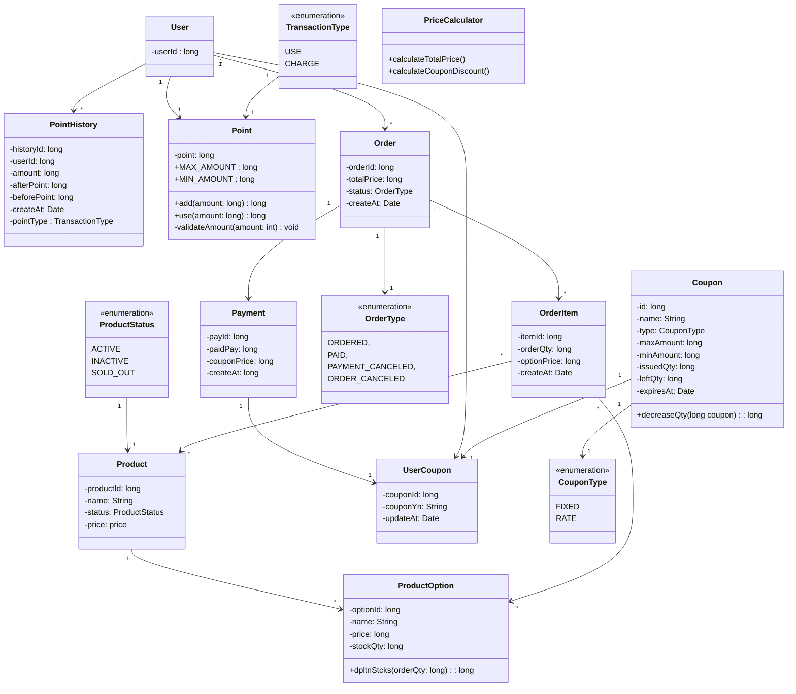

```mermaid

classDiagram
    
class User {
-userId : long
}

class PointHistory {
-historyId: long
-userId: long
-amount: long
-afterPoint: long
-beforePoint: long
-createAt: Date
-pointType : TransactionType
}

class Point {
-point: long

+MAX_AMOUNT : long
+MIN_AMOUNT : long

+add(amount: long) long
+use(amount: long) long
-validateAmount(amount: int) void
}

class TransactionType {
<<enumeration>>
USE
CHARGE
}

class ProductStatus {
<<enumeration>>
ACTIVE
INACTIVE
SOLD_OUT
}

class Product {
-productId: long
-name: String
-status: ProductStatus
-price: price
}

class ProductOption {
-optionId: long
-name: String
-price: long
-stockQty: long

+dpltnStcks(orderQty: long): long
}

class Coupon {
-id: long
-name: String
-type: CouponType
-maxAmount: long
-minAmount: long
-issuedQty: long
-leftQty: long
-expiresAt: Date

+decreaseQty(long coupon): long
}

class UserCoupon {
-couponId: long
-couponYn: String
-updateAt: Date
}

class CouponType {
<<enumeration>>
FIXED
RATE
}

class OrderType {
<<enumeration>>
ORDERED,
PAID,
PAYMENT_CANCELED,
ORDER_CANCELED

}

class Order {
-orderId: long
-totalPrice: long
-status: OrderType
-createAt: Date
}

class OrderItem {
-itemId: long
-orderQty: long
-optionPrice: long
-createAt: Date
}

class Payment {
-payId: long
-paidPay: long
-couponPrice: long
-createAt: long
}

class PriceCalculator {
+calculateTotalPrice()
+calculateCouponDiscount()
}


User "1" --> "1" Point
User "1" --> "*" PointHistory
TransactionType "1" --> "1" Point
Product "1" --> "*" ProductOption
ProductStatus  "1" --> "1" Product
User "1" --> "*" Order
Order "1" --> "*" OrderItem
Order "1" --> "1" Payment
OrderItem "*" --> "*" Product
OrderItem "*" --> "*" ProductOption
Payment "1" --> "1" UserCoupon
User "1" --> "*" UserCoupon
Coupon "1" --> "1" UserCoupon
Coupon "1" --> "1" CouponType
Order "1" --> "1" OrderType
```