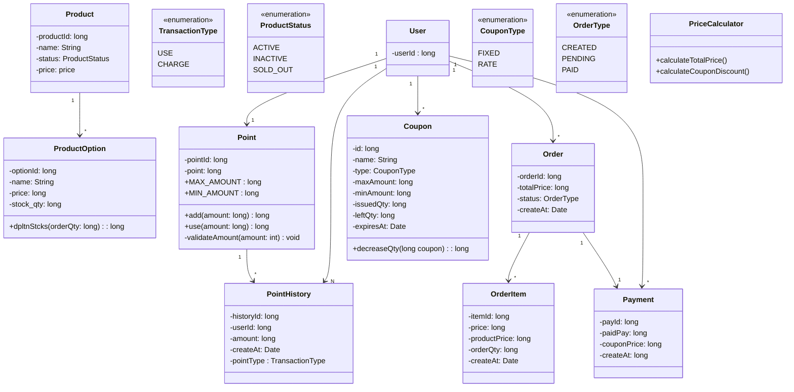

```mermaid

classDiagram

    class User {
        -userId : long
    }

    class PointHistory {
        -historyId: long
        -userId: long
        -amount: long
        -createAt: Date
        -pointType : TransactionType
    }

    class Point {
        -pointId: long
        -point: long

        +MAX_AMOUNT : long
        +MIN_AMOUNT : long

        +add(amount: long) long
        +use(amount: long) long
        -validateAmount(amount: int) void        
    }

    class TransactionType {
        <<enumeration>>
        USE
        CHARGE     
    }

    class ProductStatus {
        <<enumeration>>
        ACTIVE
        INACTIVE
        SOLD_OUT  
    }

    class Product {
        -productId: long
        -name: String
        -status: ProductStatus
        -price: price
    }

    class ProductOption {
        -optionId: long
        -name: String
        -price: long
        -stock_qty: long

        +dpltnStcks(orderQty: long): long
    }

    class Coupon {
        -id: long
        -name: String
        -type: CouponType
        -maxAmount: long
        -minAmount: long
        -issuedQty: long
        -leftQty: long
        -expiresAt: Date

        +decreaseQty(long coupon): long
    }

    class CouponType {
        <<enumeration>>
        FIXED
        RATE
    }

    class OrderType {
        <<enumeration>>
        CREATED
        PENDING
        PAID
    }

    class Order {
        -orderId: long
        -totalPrice: long
        -status: OrderType
        -createAt: Date
    }

    class OrderItem {
        -itemId: long
        -price: long
        -productPrice: long
        -orderQty: long
        -createAt: Date
    }

    class Payment {
        -payId: long
        -paidPay: long
        -couponPrice: long
        -createAt: long
    }

    class PriceCalculator {
        +calculateTotalPrice()
        +calculateCouponDiscount()
    }

    User "1" --> "1" Point
    Point "1" --> "*" PointHistory
    User "1" --> "N" PointHistory
    Product "1" --> "*" ProductOption
    User "1" --> "*" Coupon
    User "1" --> "*" Order
    Order "1" --> "*" OrderItem
    Order "1" --> "1" Payment
    User "1" --> "*" Payment

```