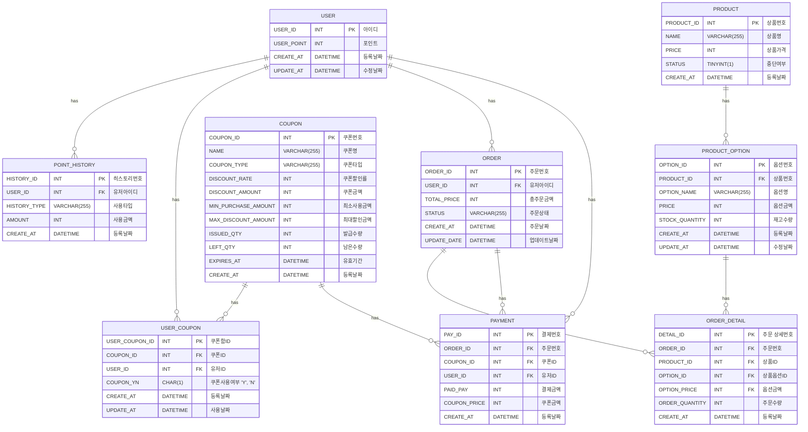

```mermaid
erDiagram
USER {
USER_ID INT PK "아이디"
USER_POINT INT "포인트"
CREATE_AT DATETIME "등록날짜"
UPDATE_AT DATETIME "수정날짜"
}
POINT_HISTORY {
HISTORY_ID INT PK "히스토리번호"
USER_ID INT FK "유저아이디"
HISTORY_TYPE VARCHAR(255) "사용타입"
AMOUNT INT "사용금액"
CREATE_AT DATETIME "등록날짜"
}
PRODUCT {
PRODUCT_ID INT PK "상품번호"
NAME VARCHAR(255) "상품명"
PRICE INT "상품가격"
STATUS TINYINT(1) "중단여부"
CREATE_AT DATETIME "등록날짜"
}
PRODUCT_OPTION {
OPTION_ID INT PK "옵션번호"
PRODUCT_ID INT FK "상품번호"
OPTION_NAME VARCHAR(255) "옵션명"
PRICE INT "옵션금액"
STOCK_QUANTITY INT "재고수량"
CREATE_AT DATETIME "등록날짜"
UPDATE_AT DATETIME "수정날짜"
}
COUPON {
COUPON_ID INT PK "쿠폰번호"
NAME VARCHAR(255) "쿠폰명"
COUPON_TYPE VARCHAR(255) "쿠폰타입"
DISCOUNT_RATE INT "쿠폰할인률"
DISCOUNT_AMOUNT INT "쿠폰금액"
MIN_PURCHASE_AMOUNT INT "최소사용금액"
MAX_DISCOUNT_AMOUNT INT "최대할인금액"
ISSUED_QTY INT "발급수량"
LEFT_QTY INT "남은수량"
EXPIRES_AT DATETIME "유효기간"
CREATE_AT DATETIME "등록날짜"
}
USER_COUPON {
USER_COUPON_ID INT PK "쿠폰함ID"
COUPON_ID INT FK "쿠폰ID"
USER_ID INT FK "유저ID"
COUPON_YN CHAR(1) "쿠폰사용여부 'Y', 'N'"
CREATE_AT DATETIME "등록날짜"
UPDATE_AT DATETIME "사용날짜"
}
ORDER {
ORDER_ID INT PK "주문번호"
USER_ID INT FK "유저아이디"
TOTAL_PRICE INT "총주문금액"
STATUS VARCHAR(255) "주문상태"
CREATE_AT DATETIME "주문날짜"
UPDATE_DATE DATETIME "업데이트날짜"
}
ORDER_DETAIL {
DETAIL_ID INT PK "주문 상세번호"
ORDER_ID INT FK "주문번호"
PRODUCT_ID INT FK "상품ID"
OPTION_ID INT FK "상품옵션ID"
OPTION_PRICE INT FK "옵션금액"
ORDER_QUANTITY INT "주문수량"
CREATE_AT DATETIME "등록날짜"
}
PAYMENT {
PAY_ID INT PK "결제번호"
ORDER_ID INT FK "주문번호"
COUPON_ID INT FK "쿠폰ID"
USER_ID INT FK "유저ID"
PAID_PAY INT "결제금액"
COUPON_PRICE INT "쿠폰금액"
CREATE_AT DATETIME "등록날짜"
}

USER ||--o{ POINT_HISTORY : has
PRODUCT ||--o{ PRODUCT_OPTION : has
COUPON ||--o{ USER_COUPON : has
USER ||--o{ USER_COUPON : has
USER ||--o{ ORDER : has
ORDER ||--o{ ORDER_DETAIL : has
PRODUCT_OPTION ||--o{ ORDER_DETAIL : has
ORDER ||--o{ PAYMENT : has
COUPON ||--o{ PAYMENT : has
USER ||--o{ PAYMENT : has
```