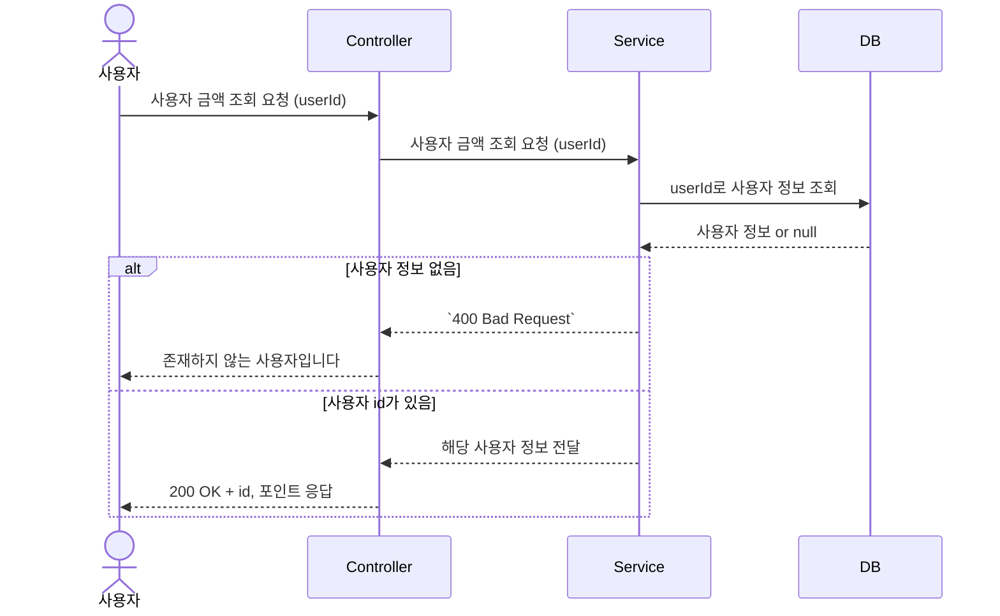
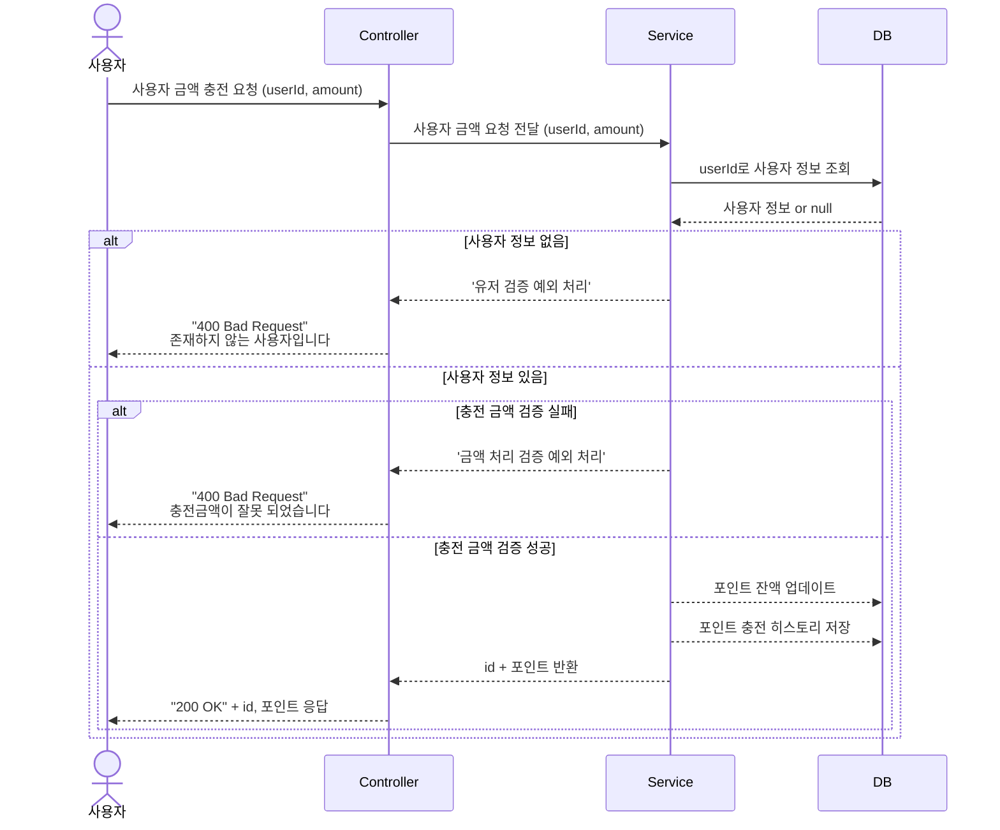
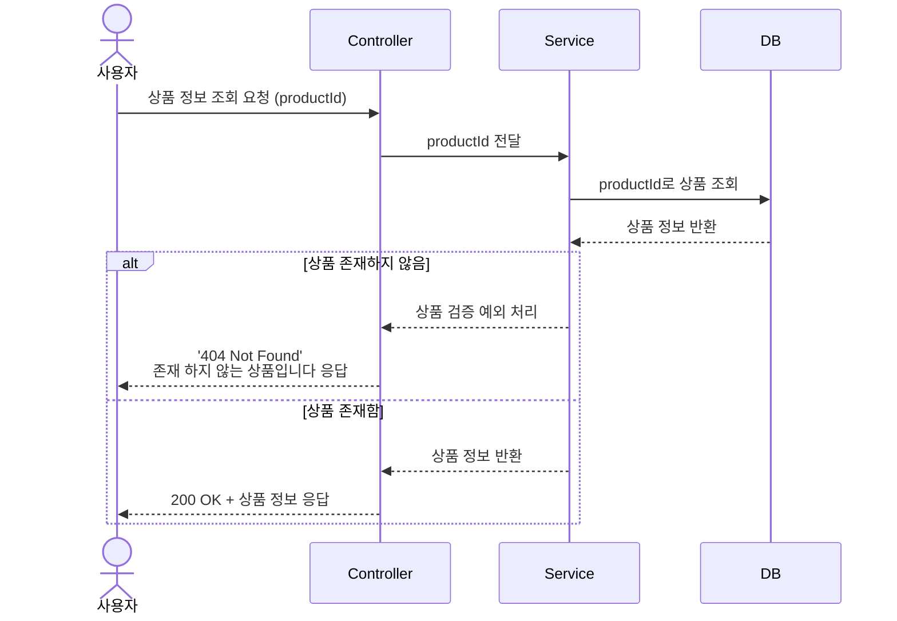
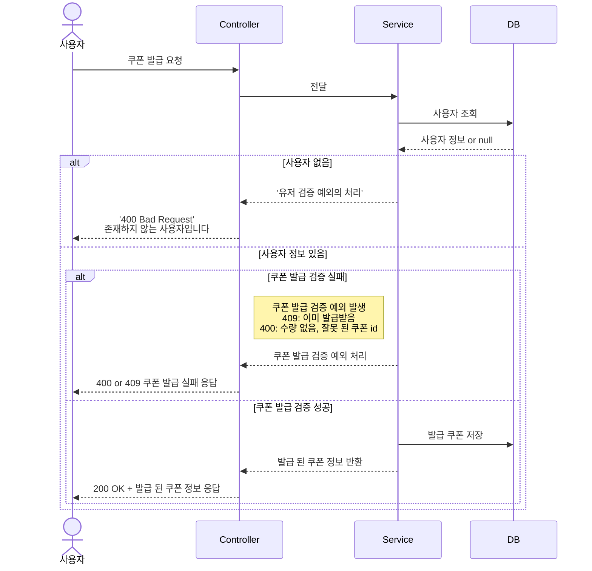
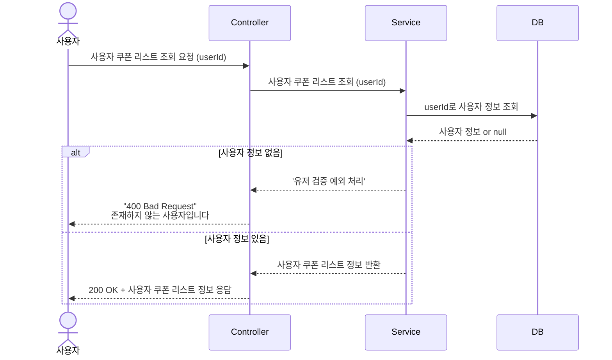
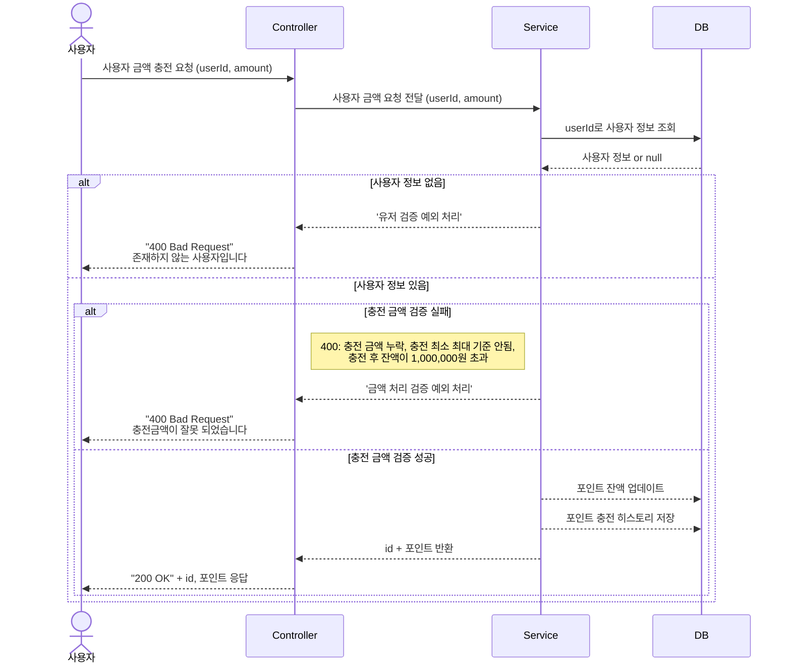
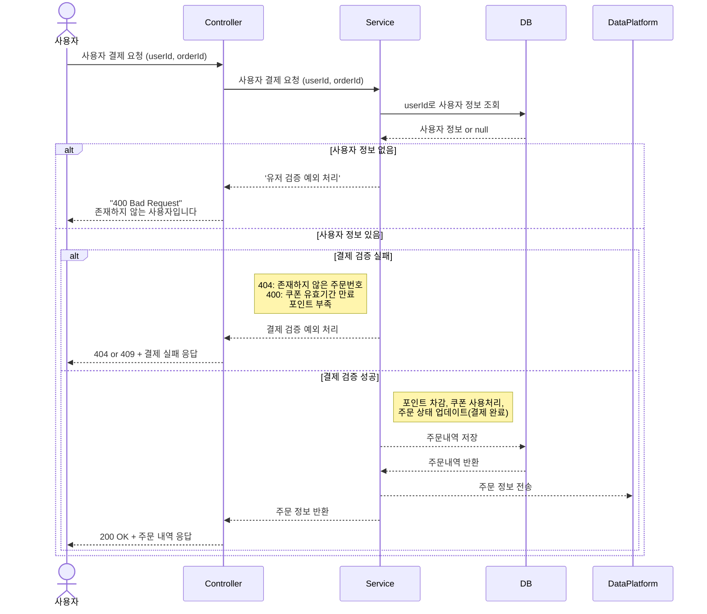
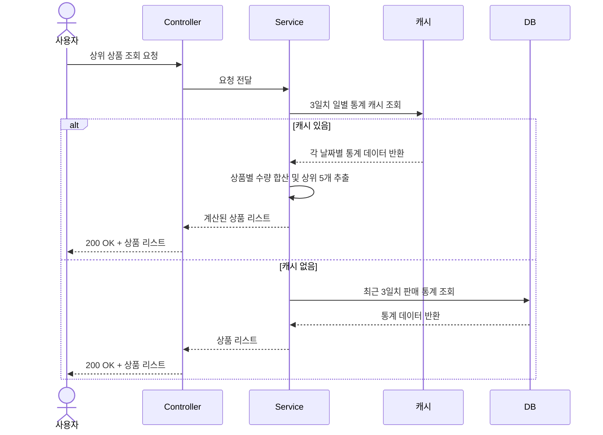
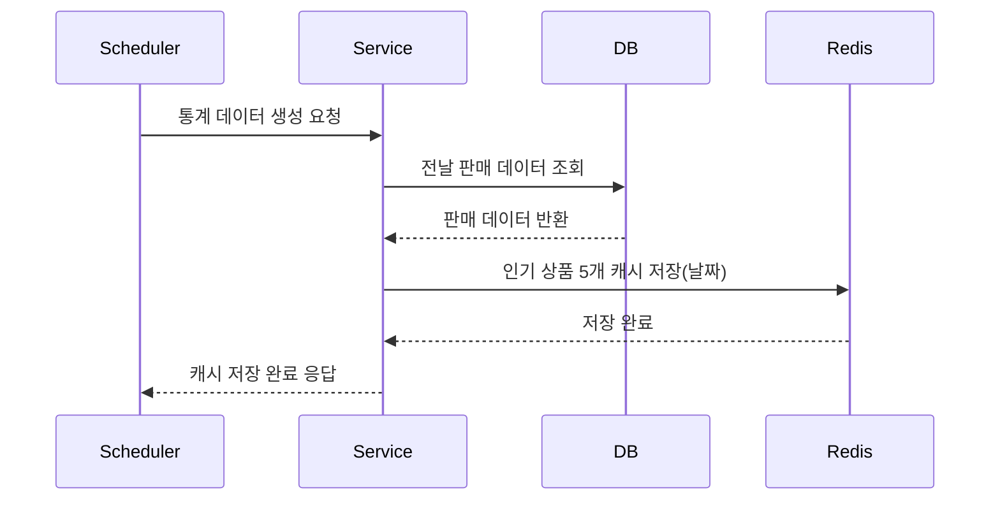

### 사용자 조회 API

---

### 포인트 충전 API

---

### 상품 조회 API

---

### 선착순 쿠폰 발급 API

---

### 쿠폰 조회 API

---

### 주문 내역 저장 API

---

### 주문 결제 API

---

### 인기 상품 조회 API

---

### 인기 상품 통계 스케줄러

