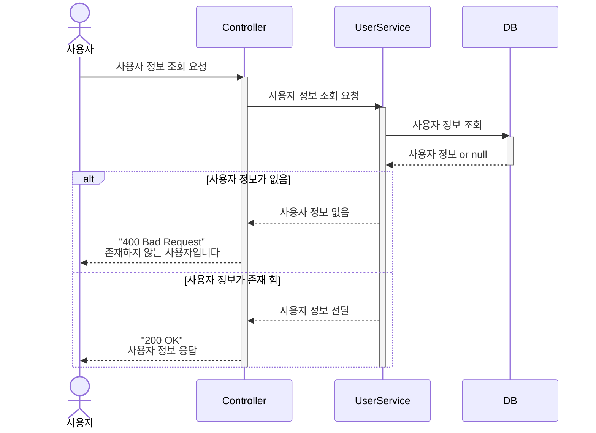
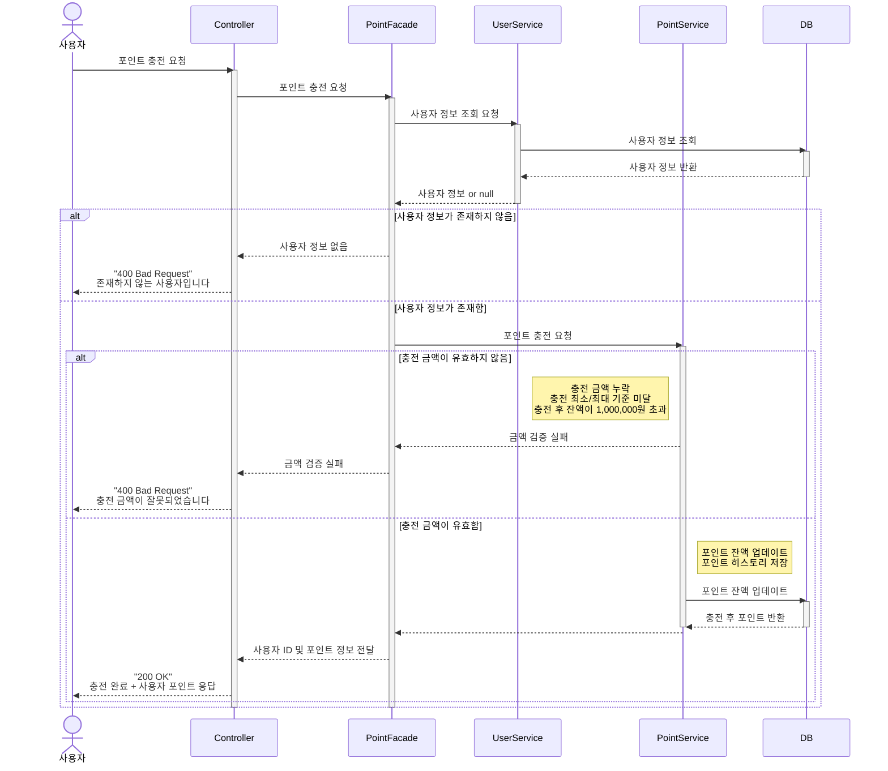
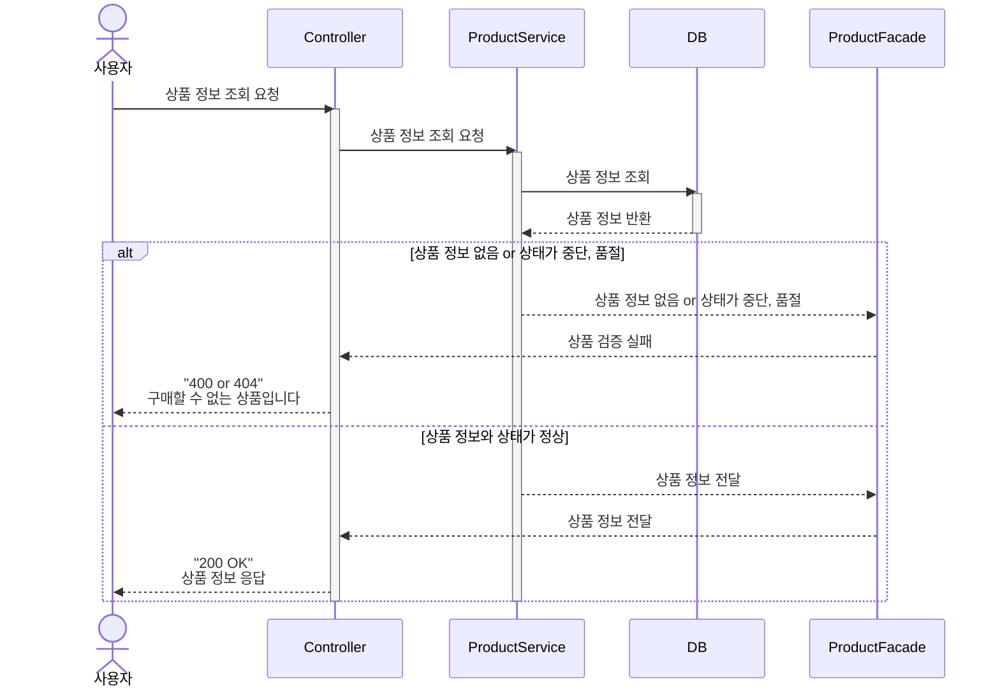
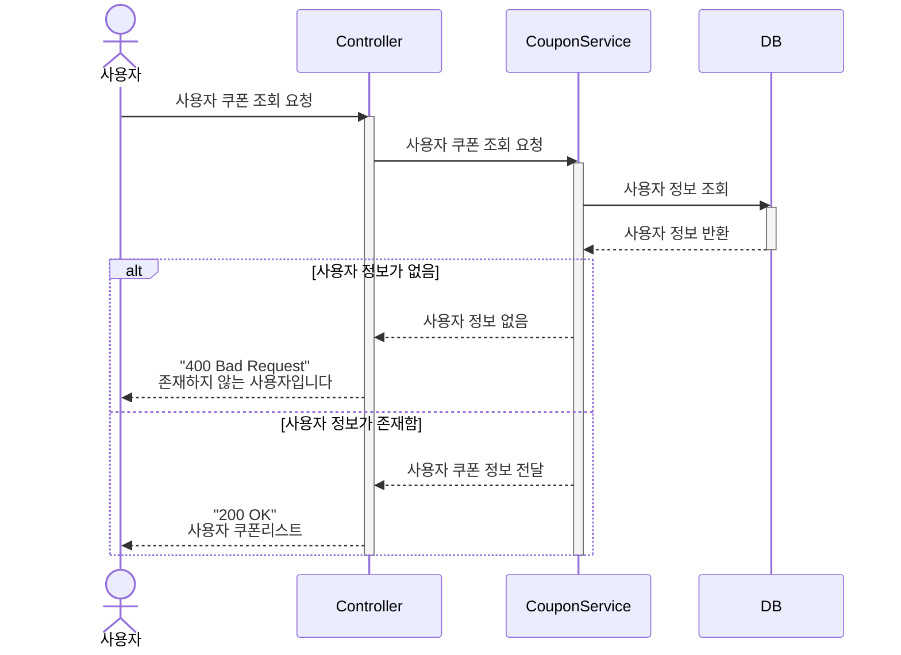
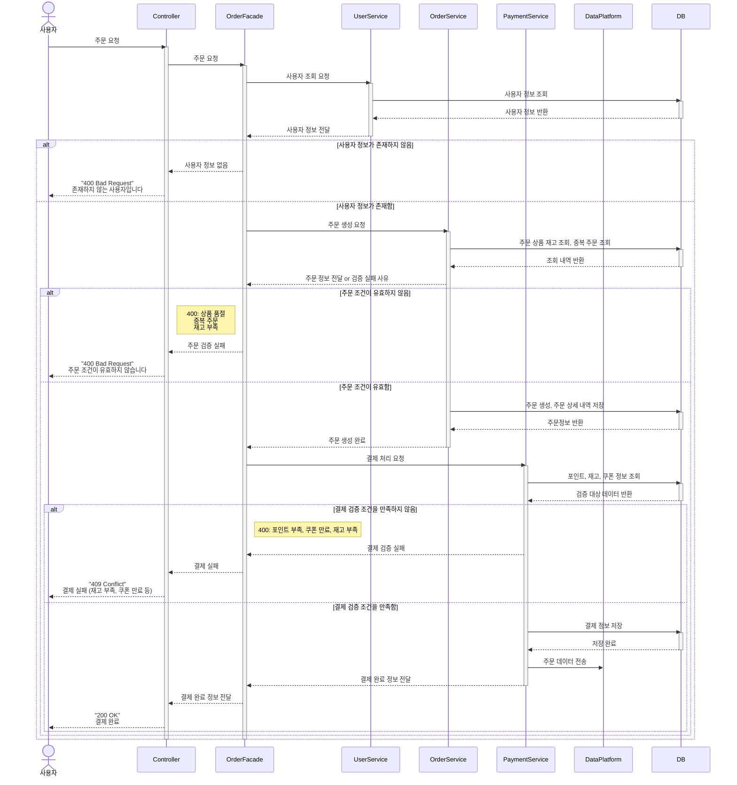
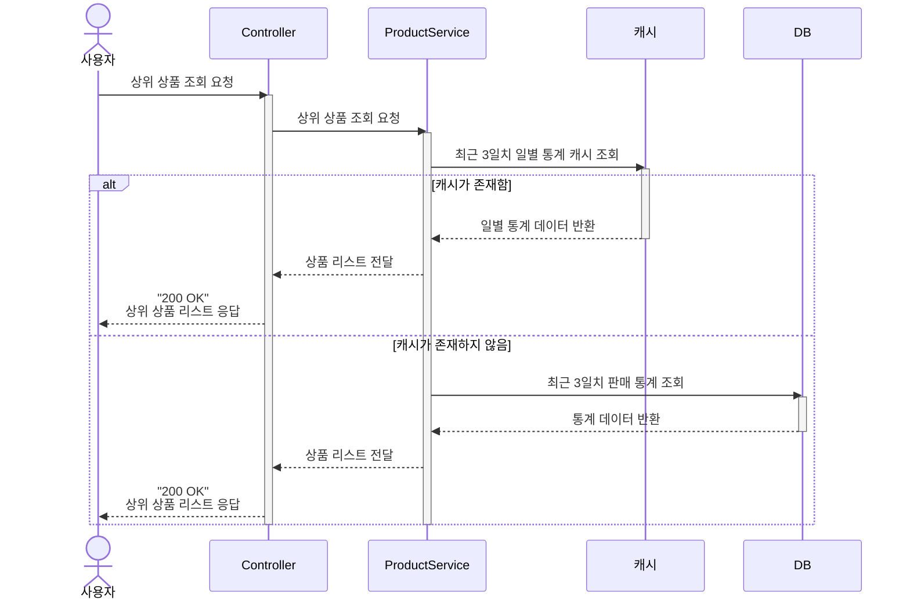
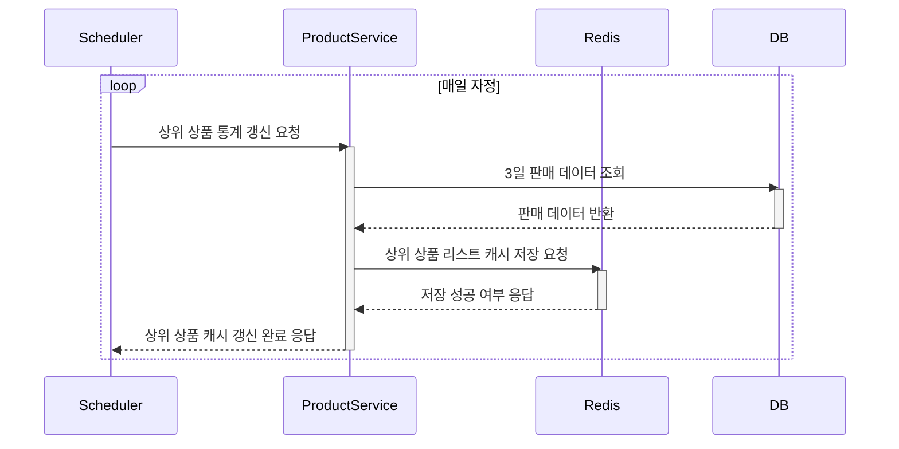

### 사용자 조회 API

```mermaid
sequenceDiagram
    actor User as 사용자
    participant Controller
    participant UserService
    participant DB

    User ->> Controller: 사용자 정보 조회 요청
    activate Controller

    Controller ->> UserService: 사용자 정보 조회 요청
    activate UserService

    UserService ->> DB: 사용자 정보 조회
    activate DB

    DB -->> UserService: 사용자 정보 or null
    deactivate DB


    alt 사용자 정보가 없음
        UserService -->> Controller: 사용자 정보 없음
        Controller -->> User: "400 Bad Request"<br>존재하지 않는 사용자입니다
    else 사용자 정보가 존재 함
        UserService -->> Controller: 사용자 정보 전달
        Controller -->> User: "200 OK"<br>사용자 정보 응답
    end

    deactivate UserService
    deactivate Controller
```

---

### 포인트 충전 API

```mermaid
sequenceDiagram
    actor User as 사용자
    participant Controller
    participant PointFacade
    participant UserService
    participant PointService
    participant DB


    User ->> Controller: 포인트 충전 요청
    activate Controller

    Controller ->> PointFacade: 포인트 충전 요청
    activate PointFacade

    PointFacade ->> UserService: 사용자 정보 조회 요청
    activate UserService

    UserService ->> DB: 사용자 정보 조회
    activate DB
    DB -->> UserService: 사용자 정보 반환
    deactivate DB

    UserService -->> PointFacade: 사용자 정보 or null
    deactivate UserService

    alt 사용자 정보가 존재하지 않음
        PointFacade -->> Controller: 사용자 정보 없음
        Controller -->> User: "400 Bad Request"<br>존재하지 않는 사용자입니다
    else 사용자 정보가 존재함
        PointFacade ->> PointService: 포인트 충전 요청
        activate PointService
        alt 충전 금액이 유효하지 않음
            Note left of PointService: 충전 금액 누락<br>충전 최소/최대 기준 미달<br>충전 후 잔액이 1,000,000원 초과
            PointService -->> PointFacade: 금액 검증 실패
            PointFacade -->> Controller: 금액 검증 실패
            Controller -->> User: "400 Bad Request"<br>충전 금액이 잘못되었습니다
        else 충전 금액이 유효함
            Note left of DB: 포인트 잔액 업데이트<br>포인트 히스토리 저장
            PointService ->> DB: 포인트 잔액 업데이트
            activate DB
            DB -->> PointService: 충전 후 포인트 반환
            deactivate DB
            deactivate PointService
            
            PointService -->> PointFacade: 

            PointFacade -->> Controller: 사용자 ID 및 포인트 정보 전달
            Controller -->> User: "200 OK"<br>충전 완료 + 사용자 포인트 응답
        end
    end

    deactivate PointFacade
    deactivate Controller
```

---

### 상품 조회 API

```mermaid
sequenceDiagram
    actor User as 사용자
    participant Controller

    participant ProductService
    participant DB

    User ->> Controller: 상품 정보 조회 요청
    activate Controller

    Controller ->> ProductService: 상품 정보 조회 요청
    activate ProductService

    ProductService ->> DB: 상품 정보 조회
    activate DB

    DB -->> ProductService: 상품 정보 반환
    deactivate DB

    alt 상품 정보 없음 or 상태가 중단, 품절
        ProductService -->> ProductFacade: 상품 정보 없음 or 상태가 중단, 품절
        ProductFacade -->> Controller: 상품 검증 실패
        Controller -->> User: "400 or 404"<br>구매할 수 없는 상품입니다
    else 상품 정보와 상태가 정상
        ProductService -->> ProductFacade: 상품 정보 전달


        ProductFacade -->> Controller: 상품 정보 전달
        Controller -->> User: "200 OK"<br>상품 정보 응답
    end

    deactivate ProductService
    deactivate Controller
```

---

### 선착순 쿠폰 발급 API

```mermaid
sequenceDiagram
    actor User as 사용자
    participant Controller
    participant CouponFacade
    participant UserService
    participant CouponService
    participant DB

    User ->> Controller: 쿠폰 발급 요청
    activate Controller

    Controller ->> CouponFacade: 쿠폰 발급 처리 요청
    activate CouponFacade

    CouponFacade ->> UserService: 사용자 정보 조회 요청
    activate UserService

    UserService ->> DB: 사용자 정보 조회
    activate DB

    DB -->> UserService: 사용자 정보 반환
    deactivate DB

    UserService -->> CouponFacade: 사용자 정보 전달
    deactivate UserService

    alt 사용자 정보가 존재하지 않음
        CouponFacade -->> Controller: 사용자 정보 없음
        Controller -->> User: "400 Bad Request"<br>존재하지 않는 사용자입니다
    else 사용자 정보가 존재함
        CouponFacade ->> CouponService: 쿠폰 발급 요청

        alt 쿠폰 발급 조건을 만족하지 않음
            Note left of CouponService: 쿠폰 발급 불가 사유<br>409: 이미 발급받은 쿠폰<br>400: 수량 없음, 잘못된 쿠폰 ID
            CouponService -->> CouponFacade: 쿠폰 발급 실패
            CouponFacade -->> Controller: 쿠폰 발급 실패
            Controller -->> User: "400 or 409"<br>쿠폰 발급에 실패했습니다
        else 쿠폰 발급 조건을 만족함
            CouponService ->> DB: 쿠폰 발급 저장
            activate DB

            DB -->> CouponService: 쿠폰 발급 완료
            deactivate DB

            CouponService -->> CouponFacade: 발급된 쿠폰 정보 전달
            CouponFacade -->> Controller: 발급된 쿠폰 정보 전달
            Controller -->> User: "200 OK"<br>쿠폰 발급 성공
        end
    end

    deactivate CouponFacade
    deactivate Controller
```

---

### 쿠폰 조회 API

```mermaid
sequenceDiagram
    actor User as 사용자
    participant Controller
    participant CouponService
    participant DB

    User ->> Controller: 사용자 쿠폰 조회 요청
    activate Controller

    Controller ->> CouponService: 사용자 쿠폰 조회 요청
    activate CouponService

    CouponService ->> DB: 사용자 정보 조회
    activate DB

    DB -->> CouponService: 사용자 정보 반환
    deactivate DB


    alt 사용자 정보가 없음
        CouponService -->> Controller: 사용자 정보 없음
        Controller -->> User: "400 Bad Request"<br>존재하지 않는 사용자입니다
    else 사용자 정보가 존재함
        CouponService -->> Controller: 사용자 쿠폰 정보 전달
        Controller -->> User: "200 OK"<br>사용자 쿠폰리스트
        
    end
    deactivate CouponService
    deactivate Controller
```

---

### 주문 API

```mermaid
sequenceDiagram
    actor User as 사용자
    participant Controller
    participant OrderFacade
    participant UserService
    participant OrderService
    participant PaymentService
    participant DataPlatform
    participant DB

    User ->> Controller: 주문 요청
    activate Controller

    Controller ->> OrderFacade: 주문 요청
    activate OrderFacade

    OrderFacade ->> UserService: 사용자 조회 요청
    activate UserService

    UserService ->> DB: 사용자 정보 조회
    activate DB
    DB -->> UserService: 사용자 정보 반환
    deactivate DB

    UserService -->> OrderFacade: 사용자 정보 전달
    deactivate UserService

    alt 사용자 정보가 존재하지 않음
        OrderFacade -->> Controller: 사용자 정보 없음
        Controller -->> User: "400 Bad Request"<br>존재하지 않는 사용자입니다
    else 사용자 정보가 존재함
        OrderFacade ->> OrderService: 주문 생성 요청
        activate OrderService

        OrderService ->> DB: 주문 상품 재고 조회, 중복 주문 조회
        activate DB

        DB -->> OrderService: 조회 내역 반환
        deactivate DB

        OrderService -->> OrderFacade: 주문 정보 전달 or 검증 실패 사유


        alt 주문 조건이 유효하지 않음
            Note left of OrderFacade: 400: 상품 품절<br>중복 주문<br>재고 부족
            OrderFacade -->> Controller: 주문 검증 실패
            Controller -->> User: "400 Bad Request"<br>주문 조건이 유효하지 않습니다
        else 주문 조건이 유효함

            OrderService ->> DB: 주문 생성, 주문 상세 내역 저장
            activate DB
            
            DB -->> OrderService: 주문정보 반환
            deactivate DB


            OrderService -->> OrderFacade: 주문 생성 완료
            deactivate OrderService

            OrderFacade ->> PaymentService: 결제 처리 요청
            activate PaymentService

            PaymentService ->> DB: 포인트, 재고, 쿠폰 정보 조회
            activate DB
            DB -->> PaymentService: 검증 대상 데이터 반환
            deactivate DB

            alt 결제 검증 조건을 만족하지 않음
                Note right of OrderFacade: 400: 포인트 부족, 쿠폰 만료, 재고 부족
                PaymentService -->> OrderFacade: 결제 검증 실패
                OrderFacade -->> Controller: 결제 실패
                Controller -->> User: "409 Conflict"<br>결제 실패 (재고 부족, 쿠폰 만료 등)
            else 결제 검증 조건을 만족함
                PaymentService ->> DB: 결제 정보 저장
                activate DB
                DB -->> PaymentService: 저장 완료
                deactivate DB

                PaymentService ->> DataPlatform: 주문 데이터 전송
                PaymentService -->> OrderFacade: 결제 완료 정보 전달
                deactivate PaymentService

                OrderFacade -->> Controller: 결제 완료 정보 전달
                Controller -->> User: "200 OK"<br>결제 완료
            end
        end
    end

    deactivate OrderFacade
    deactivate Controller

```

---

### 인기 상품 조회 API

```mermaid
sequenceDiagram
    actor User as 사용자
    participant Controller
    participant ProductService
    participant Redis as 캐시
    participant DB

    User ->> Controller: 상위 상품 조회 요청
    activate Controller


    Controller ->> ProductService: 상위 상품 조회 요청
    activate ProductService

    ProductService ->> Redis: 최근 3일치 일별 통계 캐시 조회
    activate Redis

    alt 캐시가 존재함
        Redis -->> ProductService: 일별 통계 데이터 반환
        deactivate Redis
        ProductService -->> Controller: 상품 리스트 전달
        Controller -->> User: "200 OK"<br>상위 상품 리스트 응답
    else 캐시가 존재하지 않음
        ProductService ->> DB: 최근 3일치 판매 통계 조회
        activate DB
        DB -->> ProductService: 통계 데이터 반환
        deactivate DB

        ProductService -->> Controller: 상품 리스트 전달
        Controller -->> User: "200 OK"<br>상위 상품 리스트 응답
    end

    deactivate ProductService
    deactivate Controller
```

---

### 인기 상품 통계 스케줄러

```mermaid
sequenceDiagram
    participant Scheduler
    participant ProductService
    participant Redis
    participant DB

    loop 매일 자정
        Scheduler ->> ProductService: 상위 상품 통계 갱신 요청
        activate ProductService

        ProductService ->> DB: 3일 판매 데이터 조회
        activate DB

        DB -->> ProductService: 판매 데이터 반환
        deactivate DB

        ProductService ->> Redis: 상위 상품 리스트 캐시 저장 요청
        activate Redis
        
        Redis -->> ProductService: 저장 성공 여부 응답
        deactivate Redis

        ProductService -->> Scheduler: 상위 상품 캐시 갱신 완료 응답

        deactivate ProductService
    end    
    
```

