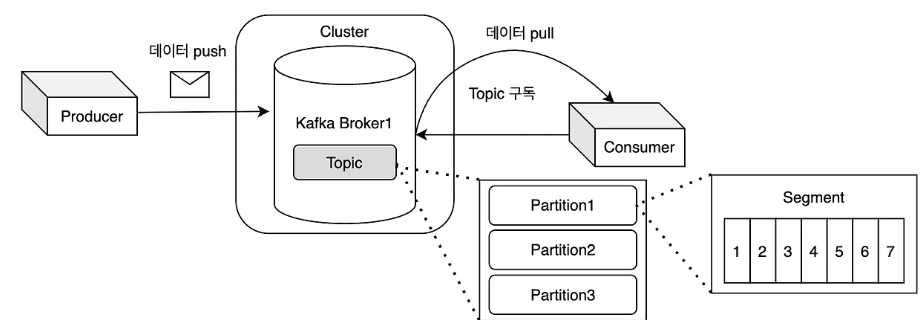
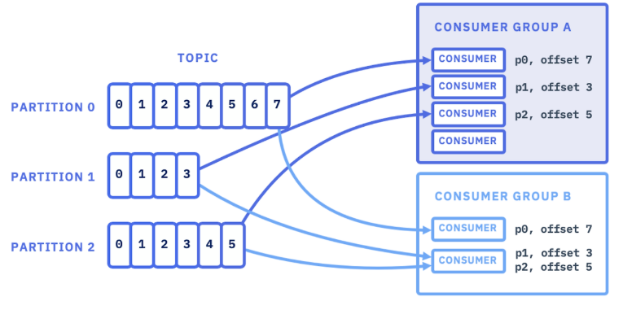
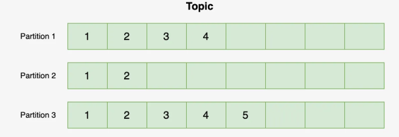

## Kafka

Pub/Sub모델이란?

- 비동기 메시지 전송 방식으로 발신자의 메시지에는 수신자가 정해져 있지 않는 상태로 발행한다. 이를 구독한 수신자만 정해진 메시지를 받을 수 있다.
- 수신자는 발신자 정보 없이 원하는 메시지만 수신할 수 있다. 이러한 구조로 인해 높은 확장성을 가질 수 있다.

Kafka란?

- 고성능 데이터 파이프라인, 스트리밍 분석, 데이터 통합 및 미션 크리티컬 애플리케이션을 위해 사용하는 오픈 분산 이벤트 스트리밍 플랫폼이다.
- 즉 실시간 이벤트 기반 애플리케이션 개발을 지원하는 것을 포함해 많은 이점을 가진 오픈소스 분산형 이벤트 스트리밍 플랫폼이다.
- Pub/Sub 모델을 따르고, 메시지 큐 형태로 동작한다. 다양한 구성 요소가 존재한다.

카프카 특징

- 카프카에서 취급하는 데이터의 단위로 <Key, message> 형태로 구성한다.
- 데이터 저장 및 관리
  - 각 브로커는 Kafka 토픽의 하나 이상의 파티션을 저장하고 관리한다. 이 파티션에는 메시지 또는 레코드가 순차적으로 저장된다.
- 클라이언트 요청 처리
  - 브로커는 Kafka 생산자로부터 데이터를 받아 저장하고, 소비자의 요청에 따라 저장 된 데이터를 제공한다.
- 고가용성 및 확장성
  - Kafka 데이터의 안정성을 위해 파티션을 여러 브로커에 복제한다. 이를 통해 하나의 브로커에 장애가 발생해도 시스템은 계속 작동할 수 있다.
  - 필요 시 클러스터에 새로운 브로커를 추가하여 시스템의 처리 능력과 저장 용량을 확장 할 수 있다.
- 통신 및 조정
  - 브로커들은 클러스터 내에서 서로 통신하여 데이터의 동기화와 상태 정보를 공유한다. 이를 통해 클러스터 전체가 일관된 상태를 유지하고, 효율적으로 작동 할 수 있다.
  - Kafka 시스템의 중추적인 역할을 하며, 데이터의 저장, 처리 및 전송을 담당한다. 브로커들의 상호작용과 조정을 통해 대용량의 데이터를 효율적이고 안정적을 관리 할 수 있다.

#### 카프카 구성요소



카프카는 클러스터 -> 브로커 -> 토픽 -> 파티션 -> 세그먼트로 구성되어 있다

#### ZooKeeper && Producer & Consumer & Broker

###### ZooKeeper

- 카프카 클러스터의 상태를 관리한다.

###### Producer

- 메시지를 카프카 브로커에 적재(발행)하는 서비스
- Producer는 메시지를 토픽에 발행한다.

###### Consumer

- 카프카 브로커에 적재된 메시지를 읽어오는 서비스다.
- 한개 이상 토픽에서 메시지를 가져올 수 있다.
- 메시지를 읽을 때마다 파티션 별로 offset을 유지해 처리했던 메시지의 위치를 추적한다.

###### Broker

- Kafka 시스템을 구성하는 개별 서버다. 이 브로커들이 Kafka 클러스터를 형성하여, 전체 시스템의 일부를 작동한다.
- Producer의 메시지를 받아 offset 지정 후 디스크에 저장한다.
- Consumer의 요청에 따라 디스크에 저장된 메시지를 전송한다.

###### Segment

- 카프카의 로그를 구성하는 물리적인 파일 단위다.
- 세그먼트는 카프카 파티션 로그를 구성하는 기본 단위이며, 파티션에 저장된 메시지는 세그먼트 파일로 분할되어 브로커의 디스크에 저장된다.
- 프로듀서에 의해 브로커로 전송된 메시지는 토픽의 파티션에 저장되며, 각 파티션은 하나 이상의 세그먼트(로그 파일)로 구성되어 로컬 디스크에 저장된다.
- Kafka는 설정에 따라 오래된 세그먼트 파일을 삭제하거나 로그 컴팩션(중복 제거)을 통해 데이터를 관리한다.

#### Consumer Group



###### Consumer Group

- 하나의 토픽에 발행된 메세지를 여러 서비스가 consume하기 위해 그룹을 설정한다.
- 하나의 주문완료 메세지를 결제서비스에서도, 상품서비스에서도 consume
- 보통 소비 주체인 Application 단위로 Consumer Group 을 생성, 관리한다.
- 같은 토픽에 대한 소비주체를 늘리고 싶다면, 별도의 컨슈머 그룹을 만들어 토픽을 구독한다.
- 같은 Consumer Group안에서는 한 파티션을 오직 consumer만 읽을 수 있다.
- 하나의 컨슈머는 여러 파티션을 읽을 수 있다.


#### Topic & Partition & Partitioner && Offset && Partitioner



- Producer → Topic: 메시지 "전송" / Topic → Consumer: 메시지 "소비

###### topic

- 다양한 종류의 이벤트나 메시지들을 분류하여 저장하는 논리적인 장소다.
- 메시지를 분류하는 기준이며 하나의 토픽은 여러 소비자가 구독 할 수 있다.
  - ex) 주문 생성 메시지를 넣는 'order-created' 토픽
    - kafkaTemplate.send("order-created", message);  프로듀서가 메시지를 보낼때 어떤 토픽에 보낼지 지정

###### Partition

- 파티션은 토픽의 병렬 처리를 위해 토픽을 여러 개로 나눈 단위이다.
- 발행된 순서대로 메시지를 소비하므로 순차 처리를 보장한다.
- 하나의 컨슈머는 하나의 파티션에 할당되어 메시지를 순차적으로 가져간다.
- 파티션 번호는 0부터 시작한다.
- 파티션은 늘릴 수 있지만 줄일 수는 없다.
- 시스템 부하가 증가할 경우, 더 많은 파티션을 추가하여 처리 능력을 확장할 수 있다 (스케일 아웃)

##### Record

- 카프카 토픽에 저장되는 하나의 메시지 단위이며, key, value, offset, timestemp, header 정보를 포함한다.
- 브로커에 저장된 레코드는 수정할 수 없고, 로그 보존 기간 또는 용량 기준에 따라 삭제된다.
- 메시지 키를 사용하면 프로듀서가 프로듀서가 토픽에 레코드를 전송할 때 메시지 키의 해시값을 토대로 파티션에 저장한다.

###### offset

- 각 파티션내 메시지의 순서를 나타내며, 파티션의 메시지가 저장된 위치를 나타내는 고유 핀이다.
- 컨슈머는 오프셋을 기준으로 어디까지 읽었는지 추적 할 수 있다.
- 파티션 내에서 데이터 위치를 표시하는 유니크한 숫자
- Current-offset
  - Consumer가 지금까지 읽은 마지막 메시지의 offset이므로 Current-offset기준으로 다음 메시지를 소비한다.
  - Consumer가 어디까지 처리했는지를 나타내는 offset이며, 동일한 메시지를 재처리하지 않고, 처리하지 않은 메시지를 건너뛰지 않기위해 마지막까지 처리한 offset을 커밋 해야된다.
  - 만약 오류가 발생하거나 문제가 발생할 경우, 컨슈머 그룹 차원에서 --reset offsets옵션을 통해 특정 시점으로 offset을 되돌릴 수 있다.

###### Partitioner

- 메시지를 발행할 때 토픽의 어떤 파티션에 저장 될지 결정하며 Producer측에서 결정한다
  - 특정 메시지에 키가 존재한다면 키의 해시 값에 매칭되는 파티션에 데이터를 전송함으로써 키가 같은 메시지를 다건 발행 하더라도, 항상 같은 파티션에 메시지를 적재해 처리순서를 보장한다.
  - 즉 같은 키는 같은 파티션으로 (hash 기반) 같은 파티션 내에서는 메시지가 순서대로 저장되고 처리되기 때문에, 동일 키에 대한 메시지 순서를 보장할 수 있어 동시성 문제를 줄일 수 있다.
  - 한 Partiton은 하나의 consumer에만 consume 할 수 있다.
  - 하나의 파티션에 여러개 consumer가 메시지를 consume하면 메시지 처리의 순서를 보장 할 수 없다.

```text
로그(log)파일은 시스템이나 애플리케이션에서 발생하는 이벤트나 데이터를 시간 순서대로 계속 덧붙여 기록하는 파일이다.
파티션은 Append-only(오로지 끝에만 저장) 방식으로 기록되는 하나의 로그 파일이다.

스케일 아웃은 서버를 여러 대 추가하여 시스템을 확장 하는 것이다.
```

#### Rebalancing

- Consmuer Group 의 **가용성과 확장성**을 확보해주는 개념이다.
- 특정 컨슈머로부터 다른 컨슈머로 파티션의 소유권을 이전시키는 행위이다.
  - e.g. `Consumer Group` 내에 Consumer 가 추가될 경우, 특정 파티션의 소유권을 이전시키거나 오류가 생긴 Consumer 로부터 소유권을 회수해 다른 Consumer 에 배정한다.
- 리밸런싱 중에는 컨슈머가 메세지를 읽을 수 없다.
  - 메시지 처리를 중단시켜야 순차 처리를 보장할 수 있다.

#### commit & auto.commit(자동커밋) & enable.auto.commit(수동커밋)

###### Commit

- 컨슈머는 메시지를 읽은 위치(offset) 를 추적하기 위해 오프셋을 커밋(commit) 한다.
- 파티션에 대해 현재 위치를 저장하는 행위가 바로 커밋이며, 커밋이 발생할 때마다 해당 파티션의 현재 오프셋 값이 갱신된다.
- 컨슈머가 poll()을 호출하면, 자신이 속한 컨슈머 그룹 기준으로 아직 읽지 않은 메시지를 카프카로부터 가져온다.
  - poll()  컨슈머가 카프카에서 메시지를 가져오는 메서드다.
- 컨슈머 그룹 내 각 컨슈머는 자신이 할당받은 파티션에 대해 오프셋을 관리하고 커밋한다.

###### 자동커밋

- enable.auto.commit을 true로 설정하면, 컨슈머는 poll() 호출 시 가장 마지막 오프셋을 자동으로 커밋한다.
- 데이터 중복이나 유실을 허용하지 않는 서비스는 자동커밋을 하면 안된다.

###### 수동커밋

- enable.auto.commit를 false로 설정하여 가장 마지막 오프셋을 수동으로 커밋한다.
- 수동 커밋의 경우, 컨슈머가 메시지를 읽고 DB에 반영한 후 커밋하는 과정에서 메시지 중복이 발생할 수 있다.

[참고]

https://velog.io/@kyukyu/Apache-Kafka-%EC%B9%B4%ED%94%84%EC%B9%B4%EC%97%90-%EB%8C%80%ED%95%9C-%EB%AA%A8%EB%93%A0-%EA%B2%83

https://resilient-923.tistory.com/402

https://jhleed.tistory.com/180

https://velog.io/@ginee_park/%EC%B9%B4%ED%94%84%EC%B9%B4-%EC%9A%A9%EC%96%B4-%EC%A0%95%EB%A6%AC-nrn2jjr0

https://firststep-de.tistory.com/41

https://devlog-wjdrbs96.tistory.com/442
