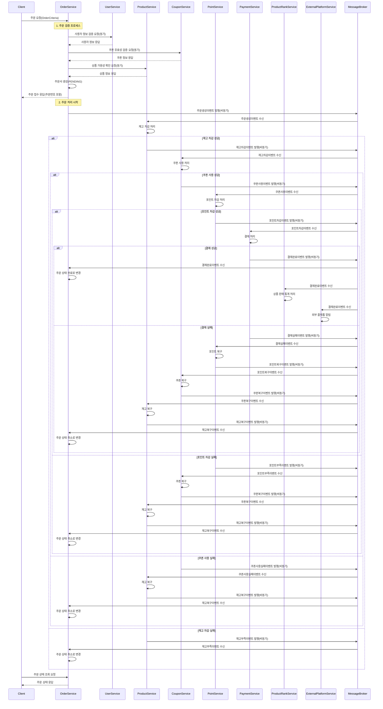

## 1. 개요

현재 이커머스 서비스는 모놀리식 구조로 구성되어 있으며, 다음과 같은 주요 문제점이 발생하고 있다

Order 도메인
├── User 도메인: ① 사용자 조회
├── Coupon 도메인: ② 쿠폰 확인
├── Product 도메인: ③ 상품 확인
├── Order 도메인: ④ 주문서 저장 ← 문제 지점 (트랜잭션 경계)
├── Payment: ⑤ 결제 처리 (쿠폰 사용, 포인트 차감 포함)
│ ├── Coupon 도메인: 쿠폰 사용
│ └── Point 도메인: 포인트 차감
└── External 도메인: ⑥ 외부 시스템으로 주문 이벤트 발행
└── ProductRank 도메인: ⑥ 주문 통계 이벤트 발행

## 2. 현행 구조의 문제점

##### 도메인 책임 불분리

```
@Transactional
public OrderResponse createOrder(OrderCriteria orderCriteria) {
	// 사용자 조회
	User user = userService.getUserInfo(orderCriteria.getUserId());
	// 쿠폰 확인
	UserCoupon userCoupon = couponService.getValidUserCouponForOrder(orderCriteria.getUserId(), orderCriteria.getCouponId());
	// 상품 확인
	List<ProductOrderResult> orderItems = productService.prepareOrderItems(ProductCommand.toCommand(orderCriteria.getItems()));
	// 주문서 저장
	Order order = orderService.createOrder(OrderItem.toCommand(orderItems), orderCriteria.getUserId());
	// 결제 로직
	Payment payment = createPayment(order.getOrderId(), user, userCoupon, orderItems);
	// 이벤트 발행...
}
```
- `OrderFacade`가 7개 서비스에 직접 의존하며 주문 생성뿐 아니라 사용자, 쿠폰, 상품, 결제 등 모든 도메인의 로직을 오케스트레이션
- 결제 로직(`createPayment()`)이 주문 도메인 내부 메소드로 구현되어 Payment 도메인 독립성 훼손


##### 트랜잭션 경계 오설정
```
@Transactional
public OrderResponse createOrder(OrderCriteria orderCriteria) {
    // 읽기 작업
    User user = userService.getUserInfo(orderCriteria.getUserId());
    UserCoupon userCoupon = couponService.getValidUserCouponForOrder(...);
    List<ProductOrderResult> orderItems = productService.prepareOrderItems(...);
    
    // 주문서 저장 (먼저 저장됨)
    Order order = orderService.createOrder(...);
    
    // 결제 처리 (주문 저장 후 진행)
    Payment payment = createPayment(order.getOrderId(), user, userCoupon, orderItems);

    // 이벤트 발행 (트랜잭션 내에서 처리)
    eventPublisher.publishProductSalesStatistics(...);
    eventPublisher.sendOrderToExternalPlatform(...);
}
```
- 주문서가 먼저 저장된 후 쿠폰 사용, 포인트 차감이 이루어져 결제 실패 시 정합성 문제 발생
- 읽기 작업과 쓰기 작업이 하나의 트랜잭션으로 묶여 트랜잭션 유지 시간이 길어짐
- 이벤트 발행까지 동일 트랜잭션에서 처리되어 실패 시 전체 롤백 위험


##### 서비스 간 강결합
```
private Payment createPayment(long orderId, User user, UserCoupon userCoupon, List<ProductOrderResult> productOrderResultList) {
    // 계산 금액
    PriceSummary priceSummary = calculator.calculateOrderAmount(user.getPoint(), userCoupon, productOrderResultList);
  
    // 쿠폰 사용
    couponService.useCoupon(userCoupon);
  
    // 포인트 차감
    pointService.usePoint(user, priceSummary.getTotalPrice());
  
    return paymentService.createPayment(user, orderId, userCoupon.getCoupon().getCouponId(), priceSummary);
}
```
- 도메인 서비스들 간의 직접 호출 체인으로 강하게 결합됨
- 모든 서비스 호출이 동기 방식으로 이루어져 한 서비스의 지연이 전체 프로세스에 영향


##### 확장성 및 성능 제약
```
@Transactional
public OrderResponse createOrder(OrderCriteria orderCriteria) {
    // 모든 로직이 단일 트랜잭션으로 묶임
}
```
- 주문 처리 로직이 단일 트랜잭션으로 묶여 도메인별 스케일 아웃이 불가능
- 읽기/쓰기 작업 분리가 어려워 성능 최적화 제한
- 불필요하게 많은 서비스 호출로 처리 지연 발생


##### ## 테스트 및 유지보수 어려
```
// OrderEventAsyncIntegrationTest.java
@Test
void 주문_완료시_상품_통계_이벤트가_발행되는지_검증() {
    // 다수의 도메인 객체와 로직이 얽혀 테스트 복잡성 증가
}
```
- 여러 도메인이 얽혀 있어 단위 테스트 작성 및 격리된 테스트가 어려움
- 도메인 간 의존성으로 인해 코드 변경 영향 범위가 넓어 유지보수 부담 증가


## 3. 마이크로서비스 아키텍처(MSA) 전환 목적

MSA(Microservice Architecture)는 하나의 애플리케이션을 도메인 단위로 나눠,각 기능을 독립적인 서비스로 개발 배포하는 아키텍처이다.
서비스마다 자체 DB와 로직을 갖고 있어 유연한 확장, 장애 격리, 독립 배포가 가능하다. 현재 시스템은 도메인 책임이 혼재되고 서비스 간 결합도가 높아  유지보수, 확장성, 배포 안정성 측면에서 비효율이 발생하고 있다. 이에 따라, 다음과 같은 목적을 가지고 MSA 전환을 추진한다

- **도메인별 자율성 확보** - 각 도메인이 독립적으로 진화하고 책임을 명확히 수행
- **선택적 확장성 구현** - 트래픽 집중 서비스만 독립 확장으로 자원 효율성 증대
- **장애 전파 방지** - 서비스 간 느슨한 결합으로 장애 영향 범위 최소화
- **독립 배포 체계 구축** - 기능별 신속한 배포로 시장 대응력 강화
- **트랜잭션 최적화** - 각 도메인에 적합한 트랜잭션 관리로 성능 향상


## 4. 주요 이슈 및 방어 전략

| 이슈                      | 방어 기법                                 | 설명                                                                                             |
| ------------------------- | ----------------------------------------- | ------------------------------------------------------------------------------------------------ |
| 데이터 불일치/일관성 문제 | Saga 패턴 + Transactional Event Publisher | 주문, 쿠폰, 재고 등이 각각 다른 DB를 쓰기 때문에, 이벤트 흐름을 통한 트랜잭션 조율이 필요함      |
| 이벤트 유실               | Outbox 패턴                               | 주문 저장 후 이벤트 발행이 실패할 경우를 방지하기 위해 DB에 먼저 이벤트를 기록하고 안전하게 발행 |
| 일시적 장애               | Retry / Kafka Retry Topic / DLQ           | 네트워크나 외부 API 지연 등으로 이벤트 처리 실패 시 자동 재시도로 안정성 확보                    |


## MSA 서비스 설계



## 5. 메시지 브로커 기반 도메인 이벤트 처리
메시지 브로커는 서비스 간 직접 호출을 대신해 이벤트로 통신하게 해주는 비동기 메시징 시스템으로,
도메인 간 결합도를 낮추고 장애 전파를 방지하며 시스템의 확장성과 성능을 동시에 확보할 수 있도록 돕는다.

- 서비스 간 직접 호출 제거로 도메인 간 결합도 최소
- 각 도메인은 이벤트 구독 방식으로 자율 처리
- 신규 기능은 이벤트 구독만으로 유연하게 확장 가능

#### 도메인 이벤트 정의 흐름

###### 정상 흐름
주문생성이벤트 → 재고차감이벤트 → 쿠폰사용이벤트 → 포인트차감이벤트 → 결제완료이벤트

###### 실패 및 보상 흐름
포인트부족이벤트, 쿠폰사용실패이벤트, 재고부족이벤트 등 발생 시
→ 포인트복구이벤트 → 쿠폰복구이벤트 → 재고복구이벤트 → 주문취소이벤트로 보상 트랜잭션 진행


## 6. 단계별 전환 전략

- 완전한 MSA로의 전환은 점진적으로 진행하며, 리스크를 최소화하기 위해 다음과 같은 단계적 접근을 취한다.
- 도메인 분리 및 경계 설정: 현재 코드베이스에서 도메인 간 경계 명확화
- 서비스 간 통신 방식 전환: 직접 호출에서 이벤트 기반 통신으로 단계적 전환
- DB 분리: 논리적 분리 → 물리적 분리로 점진적 데이터 분리
- 서비스별 독립 배포: 각 서비스의 독립적인 배포 체계 확립


## 7. 기대 효과

- 이벤트 기반 MSA 전환을 통해 다음과 같은 효과를 기대할 수 있다.
- 비즈니스 민첩성 증대: 도메인별 독립적 개발 및 배포로 새로운 기능 출시 속도 향상
- 시스템 확장성 개선: 트래픽 증가에 따른 선택적 스케일 아웃으로 비용 효율성 증대
- 서비스 회복성 강화: 장애 격리로 전체 시스템 안정성 향상
- 기술 스택 다양화: 각 도메인에 최적화된 기술 선택 가능
- 개발 생산성 향상: 작은 코드베이스로 인한 개발자 이해도 및 생산성 증가
- 이러한 아키텍처 전환은 단기적으로는 개발 복잡도 증가와 비용이 수반되지만, 장기적으로 시스템의 확장성, 유연성, 회복성 측면에서 큰 이점을 가져올 것이다.